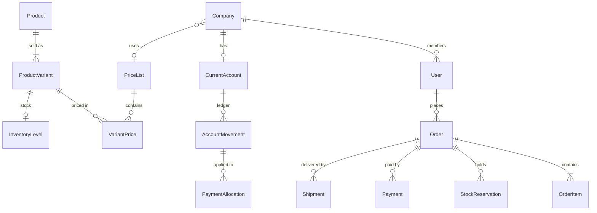

# Database

MySQL 8 through Prisma 7. The schema lives in `prisma/schema/`, **one file per domain**. Modeling rules (ids,
timestamps, soft delete and its exceptions, money) are in [rules/database.md](rules/database.md).

## Domains

| File                  | Models                                                                                                                                              | Covers (proposal)                                                       |
| --------------------- | --------------------------------------------------------------------------------------------------------------------------------------------------- | ----------------------------------------------------------------------- |
| `identity.prisma`     | `User`, `Company`, `WholesaleApplication`, `CompanyDocument`, `Address`, `AuthToken`                                                                | Registration, login, saved addresses, wholesale sign-up                 |
| `files.prisma`        | `StoredFile`                                                                                                                                        | Every upload: images, documents, receipts, invoices, Excel              |
| `catalog.prisma`      | `Brand`, `Category`, `Product`, `ProductVariant`, `ProductImage`, `ProductSpecification`, `Tag`, `ProductTag`, `BundleItem`, `ProductCompatibility` | Catalog, variants, combos, units of sale, specs, compatible consumables |
| `pricing.prisma`      | `PriceList`, `VariantPrice`, `ExchangeRate`, `Promotion`, `PromotionTarget`, `Coupon`, `CouponRedemption`                                           | Retail/wholesale prices, ARS/USD, promotions and coupons                |
| `inventory.prisma`    | `InventoryLevel`, `StockMovement`, `StockReservation`                                                                                               | Stock from Tango, reservations (payment window / 24 h)                  |
| `cart.prisma`         | `Cart`, `CartItem`, `Favorite`                                                                                                                      | Cart, favorites, abandoned carts                                        |
| `orders.prisma`       | `Order`, `OrderItem`, `OrderAddress`, `OrderStatusHistory`                                                                                          | Checkout, order history and tracking, repeat purchase                   |
| `payments.prisma`     | `Payment`, `PaymentNotification`, `TransferReceipt`, `Invoice`                                                                                      | Mercado Pago, transfers with receipt, invoices                          |
| `shipping.prisma`     | `ShippingMethod`, `ShippingQuote`, `Shipment`                                                                                                       | Store pickup, Rosario delivery, carrier quotes, tracking                |
| `accounts.prisma`     | `CurrentAccount`, `AccountMovement`, `PaymentAllocation`, `AccountImportBatch`                                                                      | Wholesale current account, partial payments, Excel import               |
| `assistant.prisma`    | `KnowledgeDocument`, `AssistantConversation`, `AssistantMessage`, `UnansweredQuestion`                                                              | AI assistant, FAQ, manuals, unanswered questions, usage                 |
| `configurator.prisma` | `ConfiguratorQuestion`, `ConfiguratorOption`, `ConfiguratorOptionTag`, `ConfiguratorSession`                                                        | Guided configurator (basic / PRO)                                       |
| `crm.prisma`          | `ProductInquiry`, `CustomerNote`, `ActivityEvent`, `WithdrawalRequest`                                                                              | CRM, most viewed/searched, "consultar", botón de arrepentimiento        |
| `system.prisma`       | `Setting`, `ExternalSync`, `EmailMessage`, `AuditLog`                                                                                               | Configuration, Tango sync status, emails, admin audit                   |

## Core relationships

## Key decisions

- **Cart now implemented.** `Cart` and `CartItem` use the existing schema, without a migration. `guestToken` stores
  the SHA-256 hash of a random cookie token. Guest tokens are invalidated when a cart is claimed or merged; owned carts
  are selected exclusively by the authenticated user. Cart lines store quantities only, with prices resolved on every
  request. Guest order completion uses nullable `Order.userId` and a unique hashed `accessTokenHash`; the migration adds
  `PaymentMethod.MANUAL`. Orders, snapshots, manual payments, reservations and status history are now used. Other
  planned domains remain provisional.
- **Favorites now implemented.** `Favorite` (user + product, unique pair) backs `/favorites`; no migration.
- **Product vs. variant.** `Product` is what the customer sees; `ProductVariant` is the SKU that is priced, stocked,
  sold and mapped to a Tango article (`tangoCode`). Every product has at least one variant, so ink colors,
  capacities or units of sale never need a schema change.
- **Buyer profile is derived, not stored on the user.** `User.role` is only `CUSTOMER` or `ADMIN`. A customer buys as
  `WHOLESALE` when `User.company.wholesaleStatus = APPROVED`; otherwise as `RETAIL`. Pausing a company switches all
  its users back to retail in one update.
- **Prices per list.** `VariantPrice` is unique per (variant, price list). Companies can get a specific list;
  otherwise the default list of their audience applies. Prices can be ARS or USD; USD is converted at checkout with
  the latest `ExchangeRate`, and the rate used is stored on the order.
- **Snapshots.** `OrderItem` and `OrderAddress` copy names, prices and addresses, so editing the catalog or an
  address never changes a past order.
- **Stock is a cache of Tango plus a ledger.** `InventoryLevel` holds `onHand`/`reserved`; every change is a
  `StockMovement`. Reservations are rows with `expiresAt`, released by a scheduled job.
- **Current account is a ledger.** Debits and credits are `AccountMovement` rows; `CurrentAccount.balance` is updated
  in the same transaction. Partial payments are `PaymentAllocation` rows that reduce a debit's `openAmount`.
- **Integrations never block a sale.** Anything sent to or received from Tango has an `ExternalSync` row with status,
  attempts and last error, shown in the admin panel. Mercado Pago webhooks are deduplicated by
  `PaymentNotification (provider, externalId)`.
- **Configuration is data.** Delivery rates and thresholds live in `ShippingMethod`; other knobs (reservation hours,
  assistant limits…) in `Setting`.
- **Configurator by tags.** Options point to `Tag`s with a weight; products are ranked by the tags they share with the
  answers. Admins tune recommendations without code changes.
